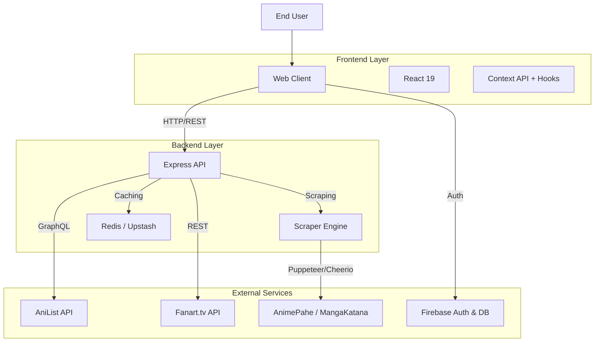

<div align="center">
  

  # Y O R U M I &nbsp; ヨルミ
  
  **A N I M E &nbsp; & &nbsp; M A N G A &nbsp; S T R E A M I N G**
  
  ---

  <br>

  
  
  
  
  
  
</div>

<br>

> A modern, feature-rich web platform for streaming anime and reading manga with a premium UI/UX experience.

<br>

> [!CAUTION]
> ## ⚠️ EDUCATIONAL PURPOSE ONLY - HEAVY DISCLAIMER
> 
> **PLEASE READ CAREFULLY BEFORE USING OR CONTRIBUTING:**
>
> 1.  **No Content Ownership**: This project does **NOT** host, store, or distribute any copyrighted files (videos, images, or audio). All content is scraped in real-time from third-party publicly available sources (e.g., AnimePahe, MangaKatana, AniList).
> 2.  **Educational Use**: This source code is strictly for **educational and research purposes**. It demonstrates modern web development techniques, scraping algorithms, and application architecture.
> 3.  **Legal Liability**: The developers and contributors of this repository assume **NO LIABILITY** for any misuse of this software. Users are solely responsible for ensuring their usage complies with local laws and the Terms of Service of the source websites.
> 4.  **No Commercial Use**: This project is **NOT** for sale and should not be used for any commercial activities.

<br>


## ✨ Features

- **🎬 Unified Streaming Experience**: Seamlessly watch anime with HLS support and auto-quality selection.
- **📚 Integrated Manga Reader**: High-performance manga reader with vertical/horizontal modes and infinite scrolling.
- **⚡ Advanced Scraper Engine**: 
    - Real-time data fetching from multiple sources.
    - **Fuzzy Matching**: Intelligent title matching using `fuzzball` to bridge metadata differences between AniList and content sources.
    - **Cloudflare Bypass**: Integrated Puppeteer strategies to handle protected sources.
- **🚀 Performance First**: 
    - **Redis Caching**: Server-side caching for API responses, search results, and stream links.
    - **Lazy Loading**: Progressive image loading and component code-splitting.
- **🎨 Premium UI/UX**: 
    - Glassmorphic design system using **Tailwind CSS**.
    - Smooth animations with **Framer Motion** (implied via UI quality).
    - Responsive layout for desktop and mobile web.
- **☁️ Cloud Sync**: **Firebase** integration for syncing user progress, bookmarks, and settings across devices.

## 📸 Screenshots

### Desktop View
<table>
  <tr>
    <td width="50%">
      
      <p align="center"><b>Anime Discovery</b></p>
    </td>
    <td width="50%">
      
      <p align="center"><b>Anime Details</b></p>
    </td>
  </tr>
  <tr>
    <td>
      
      <p align="center"><b>Manga Discovery</b></p>
    </td>
    <td>
      
      <p align="center"><b>Manga Details</b></p>
    </td>
  </tr>
  <tr>
    <td>
      
      <p align="center"><b>Video Player</b></p>
    </td>
    <td>
      
      <p align="center"><b>Manga Reader</b></p>
    </td>
  </tr>
   <tr>
    <td colspan="2">
      
      <p align="center"><b>User Profile</b></p>
    </td>
  </tr>
</table>

### Mobile Responsiveness
<table>
  <tr>
    <td width="33%"></td>
    <td width="33%"></td>
    <td width="33%"></td>
  </tr>
</table>

## 🏗️ Architecture

Yorumi uses a client-server web architecture.



### 🛠️ Tech Stack

#### **Frontend (Web)**
- **Core**: React 19, TypeScript
- **Build Tool**: Vite (Rolldown)
- **Styling**: Tailwind CSS, PostCSS
- **State Management**: React Hooks & Context
- **Routing**: React Router v7
- **Video**: HLS.js
- **Icons**: Lucide React

#### **Backend (API & Scraper)**
- **Runtime**: Node.js
- **Framework**: Express.js
- **Database / Cache**: Redis (@upstash/redis) for high-performance caching.
- **Scraping**: 
    - **Puppeteer Core**: Headless browser automation for dynamic sites.
    - **Cheerio**: Lightweight HTML parsing for static content.
    - **Fuzzball**: Fuzzy logic string matching for reliable search results.
- **API Clients**: 
    - GraphQL Request (for AniList)
    - Axios (for Fanart.tv and HTTP requests)
- **External APIs**:
    - **Fanart.tv**: Anime title logo artwork
    - **AniList**: Anime/manga metadata
    - **Fribb/anime-lists**: AniList to TVDB ID mapping

#### **DevOps & Tools**
- **Linting**: ESLint, Prettier
- **Package Manager**: npm
- **Bundler**: Vite (Rolldown)

## 🚀 Getting Started

### Prerequisites
- **Node.js** (v18 or higher recommended)
- **npm** or **yarn**
- **Redis Instance** (Optional but recommended for performance. Local or Upstash)

### Installation

1.  **Clone the Repository**
    ```bash
    git clone https://github.com/davenarchives/yorumi.git
    cd yorumi
    ```

2.  **Install Root Dependencies**
    ```bash
    npm install
    ```

3.  **Install Backend Dependencies**
    ```bash
    cd backend
    npm install
    cd ..
    ```

### Running Locally (Web Mode)

To run the application as a standard web app (Client + Server):

1.  **Start the Backend**
    ```bash
    cd backend
    npm run dev
    ```
    *Server runs on `http://localhost:3001`*

2.  **Start the Frontend** (in a new terminal)
    ```bash
    npm run dev
    ```
    *Client runs on `http://localhost:5173`*


### Running the Anime Download CLI

The backend package also ships a small CLI for downloading anime episodes from the scraper source.

```bash
cd backend
npm run build
node dist/cli.js --help
```

Download an episode:

```bash
node dist/cli.js download anime "Frieren" --episode 1
node dist/cli.js download-anime "One Piece" -e 1089 --quality 720 --dub
```

For local development without building first, use:

```bash
cd backend
npm run cli -- download anime "Frieren" -e 1
```

CLI options:

- `download anime <title>` or `download-anime <title>` searches and downloads an anime episode.
- `-d, --download <title>` keeps the legacy flag-based form.
- `-e, --episode <number>` selects the episode number. Defaults to `1`.
- `-o, --output <dir>` sets the download folder. Defaults to `downloads`.
- `-q, --quality <height>` prefers a stream height such as `1080` or `720`. Defaults to `best`.
- `--dub` prefers dubbed audio. `--sub` prefers subbed audio.
- `-y, --yes` skips prompts and overwrites an existing output file.

## 📁 Project Structure

```bash
yorumi/
├── backend/                 # Express API & Scraper Server
│   ├── src/
│   │   ├── api/             # REST API Controllers (AniList, Manga, etc.)
│   │   ├── scraper/         # Scraping Logic (AnimePahe, MangaKatana)
│   │   └── index.ts         # Server Entry Point
├── src/                     # React Frontend Code
│   ├── components/          # Reusable UI Components
│   ├── features/            # Feature-based Modules (Anime, Manga, Player)
│   ├── hooks/               # Custom React Hooks
│   ├── pages/               # Page Views
│   ├── services/            # Frontend API Services
│   ├── types/               # TypeScript Definitions
│   └── App.tsx              # Main App Component
├── public/                  # Static Assets
└── package.json             # Root Config & Scripts
```

## 🤝 Contributing

Contributions are welcome! Please follow these steps:

1.  Fork the repository.
2.  Create a feature branch: `git checkout -b feature/amazing-feature`.
3.  Commit your changes: `git commit -m 'feat: Add amazing feature'`.
4.  Push to the branch: `git push origin feature/amazing-feature`.
5.  Open a Pull Request.

## 📄 License

Distributed under the MIT License. See `LICENSE` for more information.

---

**Made with ❤️ by Daven**
